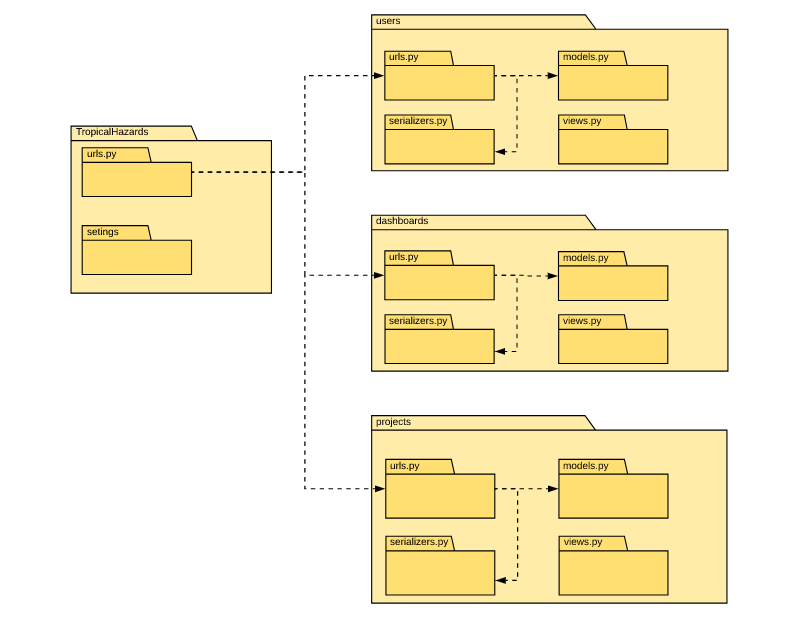

<!-- Template de Documento de Arquitetura de Software versão em Markdown-->
# **Tropical Hazards**

Documento de Arquitetura
===================

----------
## Histórico  de Revisões

| Data | Versão | Descrição | Autores |
|:----:|:------:|:---------:|:-------:|
| **/03/2018 | 1.0 | Abertura do documento | - |
| **/03/2018 | 1.1 | - | - |
| **/03/2018 | 1.2 | - | - |
| **/03/2018 | 1.3 | - | - |
-----------

Sumário
----------------

* 1 .  [Introdução](#1-introdução)
    * 1.1. [Finalidade](#11-finalidade)
    * 1.2. [Escopo](#12-escopo)
    * 1.3 [Definições, Acrônimos e Abreviações](#13-definições-acrônimos-e-abreviações)
    * 1.4 [Referências](#14-referências)
    * 1.5 [Visão Geral](#15-visão-geral)
* 2 . [Representação da Arquitetura](#2-representação-da-arquitetura)
* 3 . [Metas e Restrições de Arquitetura](#3-metas-e-restrições-de-arquitetura)
* 4 . [Visão de Casos de Uso](#4-visão-de-casos-de-uso)
    * 4.1 [Realizações de Casos de Uso](#41-realizações-de-casos-de-uso)
* 5 . [Visão Lógica](#5-visão-lógica)
    * 5.1 [Visão Geral](#51-visão-geral)
    * 5.2 [Pacotes de Design Significativos do Ponto de Vista da Arquitetura](#52-pacotes-de-design-significativos-do-ponto-de-vista-da-arquitetura)
* 6 . [Visão de Processos](#6-visão-de-processos)
* 7 . [Visão de Implantação](#7-visão-de-implantação)
* 8 . [Visão de Implementação](#8-visão-de-implementação)
    * 8.1 [Visão Geral](#81-visão-geral)
    * 8.2 [Camadas](#82-camadas)
* 9 . [Visão de Dados (opcional)](#9-visão-de-dados-opcional)
* 10 . [Tamanho e Desempenho](#10-tamanho-e-desempenho)
* 11 . [Qualidade](#11-qualidade)
-----------

## 1. Introdução

*[A introdução do Documento de Arquitetura de Software deve apresentar uma visão geral de todo o Documento de Arquitetura de Software. Ela deve incluir a finalidade, o escopo, as definições, os acrônimos, as abreviações, as referências e uma visão geral do Documento de Arquitetura de Software.]*

### 1.1 Finalidade

Este documento apresenta uma visão geral da arquitetura do sistema e utiliza uma série de visões arquiteturais diferentes para ilustrar os diversos aspectos do sistema. Sua intenção é capturar e transmitir as decisões significativas do ponto de vista da arquitetura que foram tomadas em relação ao sistema.

*[Esta seção define a finalidade do Documento de Arquitetura de Software, na documentação geral do projeto, e contém uma breve descrição da estrutura do documento. Os públicos específicos do documento devem ser identificados, com uma indicação de como devem usá-lo.]*

### 1.2 Escopo

*[Faça uma breve descrição da aplicação do Documento de Arquitetura de Software; o que é afetado ou influenciado por este documento.]*

### 1.3 Definições, Acrônimos e Abreviações

*[Esta subseção deve apresentar as definições de todos os termos, acrônimos e abreviações necessários para a correta interpretação do Documento de Arquitetura de Software. Essas informações podem ser fornecidas mediante referência ao Glossário do projeto.]*

### 1.4 Referências

*[Esta subseção deve apresentar uma lista completa de todos os documentos mencionados no Documento de Arquitetura de Software. Cada documento deve ser identificado por título, número de relatório (se aplicável), data e organização responsável pela publicação. Especifique as fontes das quais é possível obter referências. Essas informações podem ser fornecidas por um anexo ou outro documento.]*

### 1.5 Visão Geral

*[Esta subseção deve descrever o conteúdo restante do Documento de Arquitetura de Software e explicar como o Documento de Arquitetura de Software está organizado.]*

## 2. Representação da Arquitetura

A arquitetura utilizada contém dois ambientes diferentes para a nossa aplicação, o ambiente de controle de dados que é conhecido como API e o um ambiente web para os usuarios, contemplando um portal onde a população interessada possa ter acesso as informações e um sistema de dash boards para usuários gerenciadores de conteúdo, podem assim inserir, compartilhar e salvar dados através da aplicação.

Com relação a API o  projeto **Tropical Hazards** será desenvolvido utilizando o framework Django Rest, que conta com um padrão arquitetural próprio conhecido como MVT, o qual será adotado, com algumas alterações, na execução desse projeto.

Django, segundo o próprio Django Book, segue o padrão MVC suficientemente para que este seja considerado um framework MVC, entretanto deve-se salientar a diferença entre os padrões arquiteturais.

No padrão MVC clássico a aplicação é dividida em três principais componentes interconectados, sendo estes:
<ul>
  <li> <b>Model</b> : é incumbido de tratar a parte lógica relacionada aos dados, sendo encarregado por definir sua estrutura, consultas e validação destes, atentando, obviamente, às regras de negócio relacionadas ao banco de dados.</li>
  <li> <b>View</b> : é responsável pela visualização gráfica da interface de usuário, definindo, portanto, como ocorrerão as interações com o usuário. Deve-se salientar que a View está em contato direto com a Controller, sendo esta última responsável por provêr os dados que serão renderizadas pela View.</li>
  <li> <b>Controller</b> : efetua a comunicação entre a Model e View. As requisições de usuário são processadas pela Controller que efetua as interações necessárias com a Model, enviando as demandas e recebendo dados que são posteriormente enviados para a View. É nesta camada são definidas as regras de negócio referentes à manipulação do sistema.</li>

")

Figura 2.1 - Padrão MVC (Fonte : http://abap101.com/wp-content/uploads/2011/08/mvc.png)

No padrão MVT utilizado pelo Django ocorre a separação em três partes: **Model**, **View**, **Template**. Fazendo um paralelo com o modelo MVC clássico, a View e o Template do MVT assemelham-se, respectivamente, com a Controller e a View do MVC. Essas partes podem ser melhor definidas como:
<ul>
  <li> <b>Model</b> : a Model do MVT pode ser considerada equivalende a do MVC em termos de responsabilidade, entretanto deve-se notar que o Framework Django facilita na interface com o banco de dados.</li>
  <li> <b>View</b> : na View está contida a lógica de negócio, possuindo a lógica que define o acesso a Model e sendo responsável por enviar e definir quais dados serão exibidos na camada de Template, assemelhando-se, conforme dito anteriormente, a camada Controller do MVC clássico.</li>
  <li> <b>Template</b> : nesta camada são definidos como os dados recebidos através da View serão exibidos ao usuário, sendo, esta camada, responsável por renderizar a interface gráfica do usuário, tal qual a camada View no MVC clássico.</li>

Figura 2.2 - Padrão MTV (Fonte : https://arquivo.devmedia.com.br/artigos/guias/arquitetura_MTV.png)

Juntamente com o Django utilizaremos utilizaremos uma de suas extenções o Framework Django Rest. Esta ferramenta auxiliara na construção da API do sistema, oferencendo também uma serie de outras ferramentas. Uma dessas ferramentas são os Serializers que possibilitam a conversão de tipos de dados complexos em Python, XML, JSON, entre outras. O Framework Rest também oferecem ferramentas para autenticação, e controle de requerimentos.

No frontend será utilizado o framework em javascript **Vue JS**, uma ferramenta para o desenvolvimento de Single-Page Applications. O **VueJS** desempenhará o papel de unir o template à model sendo necessário que haja uma integração entre as duas ferramentas.

Este framework de JavaScript possibilita o desenvolvimento de interfaces para o usuários com componentes reativos, ou seja pedaços de código reaproveitáveis formados por marcação, estilo e comportamento.  Entretanto, esta ferramenta e não consegue fazer contato direto com a camada View do Django, para isso utilizaremos a formatação JSON.  

O **JSON** (Java Script Object Notation) é uma formatação leve de troca de dados, fácil de ser gerada e interpretada por máquinas. Sua utilização é necessária devido o fato de que as trocas de dados entre interfaces e servidores devem existir somente em formato de texto. Através do JSON é possível converter qualquer objeto JavaScript em texto e qualquer JSON recebido do servidor em objetos JavaScript. Podendo assim trabalhar com os objetos JavaScript como dados comuns.

## 3. Metas e Restrições de Arquitetura

*[Esta seção descreve os requisitos de software e os objetivos que têm um impacto significativo na arquitetura, como proteção, segurança, privacidade, uso de um produto desenvolvido internamente e adquirido pronto para ser usado, portabilidade, distribuição e reutilização. Ela também captura as restrições especiais que podem ser aplicáveis: estratégia de design e implementação, ferramentas de desenvolvimento, estrutura das equipes, cronograma, código-fonte legado e assim por diante.]*

## 4. Visão de Casos de Uso

*[Esta seção lista os casos de uso ou cenários do modelo de casos de uso se eles representam uma funcionalidade central e significativa do sistema final ou se têm uma ampla cobertura de arquitetura, ou seja, se experimentam muitos elementos arquiteturais ou se enfatizam ou ilustram um determinado ponto frágil da arquitetura.]*

### 4.1 Realizações de Casos de Uso

*[Esta seção ilustra o funcionamento do software, apresentando algumas realizações (ou cenários) de casos de uso selecionadas e explica como os diversos elementos do modelo de design contribuem para a respectiva funcionalidade.]*

## 5. Visão Lógica

*[Esta seção descreve as partes significativas do ponto de vista da arquitetura do modelo de design, como sua divisão em subsistemas e pacotes. Além disso, para cada pacote significativo, ela mostra sua divisão em classes e utilitários de classe. Apresente as classes significativas do ponto de vista da arquitetura e descreva suas responsabilidades, bem como alguns relacionamentos, operações e atributos de grande importância.]*

### 5.1 Visão Geral

### 5.1.2 Diagrama de pacotess

O diagrama abaixo representa a arquitetura de pacotes presente no sistema. É possivel notar como que as principais classes do sistema são representadas através destes pacotes, e suas funcionalidades implementadas por meio destes.

### 5.2 Pacotes de Design Significativos do Ponto de Vista da Arquitetura

#### 5.2.1. View
A View será responsável por gerenciar os dados e os comportamentos da aplicação. Ela fará a ligação da model com o Vue JS .

#### 5.2.2 Model
A pasta denominada model trará o conceito de abstração à situação apresentada no mundo real, identificando as entidades a serem utilizadas na aplicação. Além disso, a model deverá garantir a comunicação com o banco de dados.

#### 5.2.4 Database(Banco de Dados)
Neste pacote haverá as configurações e o estado do banco de dados. Nela estará o responsável por manter, em tabelas, e fazer as alterações dos dados quando necessário.

#### 5.2.5 Test (Teste)
A aplicação de testes durante a implementação de uma aplicação é de extrema importância, por esse motivo, haverá no projeto uma pasta teste a fim de englobar os arquivos desenvolvidos para tal atividade.

## 6. Visão de Processos

*[Esta seção descreve a decomposição do sistema em processos leves (threads simples de controle) e processos pesados (agrupamentos de processos leves). Organize a seção em grupos de processos que se comunicam ou interagem. Descreva os modos principais de comunicação entre processos, como transmissão de mensagens e interrupções.]*

## 7. Visão de Implantação

*[Esta seção descreve uma ou mais configurações da rede física (hardware) na qual o software é implantado e executado. Ela é uma visão do Modelo de Implantação. Para cada configuração, ela deve indicar no mínimo os nós físicos (computadores, CPUs) que executam o software e as respectivas interconexões (barramento, LAN, ponto a ponto e assim por diante.) Inclua também um mapeamento dos processos da Visão de Processos nos nós físicos.]*

## 8. Visão de Implementação

*[Esta seção descreve a estrutura geral do modelo de implementação, a divisão do software em camadas e subsistemas no modelo de implementação e todos os componentes significativos do ponto de vista da arquitetura.]*

### 8.1 Visão Geral

*[Esta subseção nomeia e define as diversas camadas e o seu conteúdo, as regras que determinam a inclusão em uma camada específica e as fronteiras entre as camadas. Inclua um diagrama de componentes que mostre os relacionamentos entre as camadas.]*

### 8.2 Camadas

*[Para cada camada, inclua uma subseção com o respectivo nome, uma lista dos subsistemas localizados na camada e um diagrama de componentes.]*

## 9. Visão de Dados (opcional)

*[Uma descrição da perspectiva de armazenamento de dados persistentes do sistema. Esta seção será opcional se os dados persistentes forem poucos ou inexistentes ou se a conversão entre o Modelo de Design e o Modelo de Dados for trivial.]*

## 10. Tamanho e Desempenho

*[Uma descrição das principais características de dimensionamento do software que têm um impacto na arquitetura, bem como as restrições do desempenho desejado.]*

## 11. Qualidade

*[Uma descrição de como a arquitetura do software contribui para todos os recursos (exceto a funcionalidade) do sistema: extensibilidade, confiabilidade, portabilidade e assim por diante. Se essas características tiverem significado especial, como, por exemplo, implicações de proteção, segurança ou privacidade, elas devem ser claramente delineadas.]*
