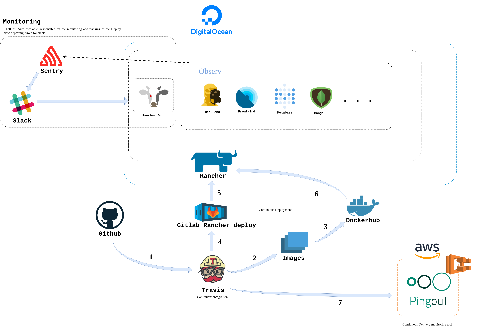

## Pipeline DevOps

Este documento apresenta o pipeline de Deploy contínuo apoiado pelo fluxo de DevOps definido, recursos integrados e ChatOps.
O processo de deploy iniciado no Travis-CI é realizado com a submissão das imagens dos contêineres para o dockerhub, sendo que também é utilizada a ferramenta Gitlab Rancher Deploy para deploy dos contâineres para infraestrutura criada no rancher. O PingOut foi um software desenvolvido pela equipe, integrado ao script do Travis e hospedado no Amazon Web service para contagem dos deploys, permitindo acompanhar e evidenciar a entrega contínua. O Sentry é integrado ao slack para monitorar e produzir relatórios em tempo real de possíveis problemas no Software. A evolução do processo de DevOps foi possibilitada com a criação do Rancher-bot, permitindo executar as práticas do ChatOps, garantindo visibilidade de todo o processo de deploy, controle do processo e notificações através da digitação de comandos simples para um bot no chat do slack, que controla o processo através de scripts e plugins.

