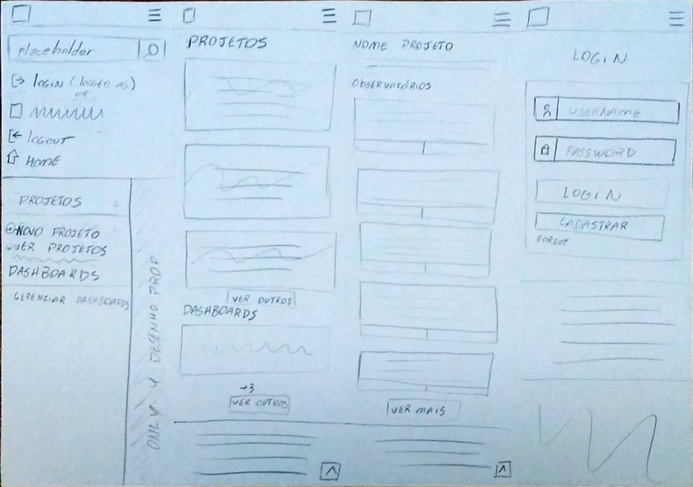
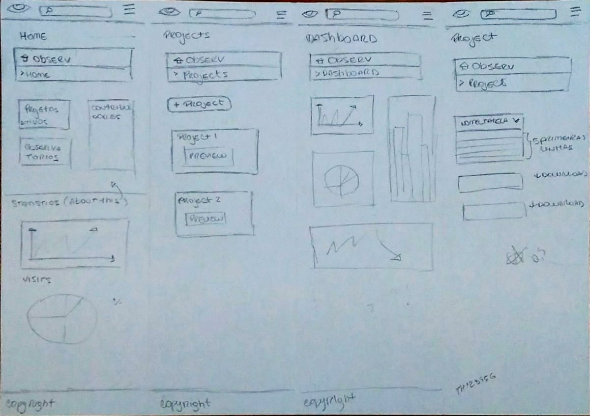
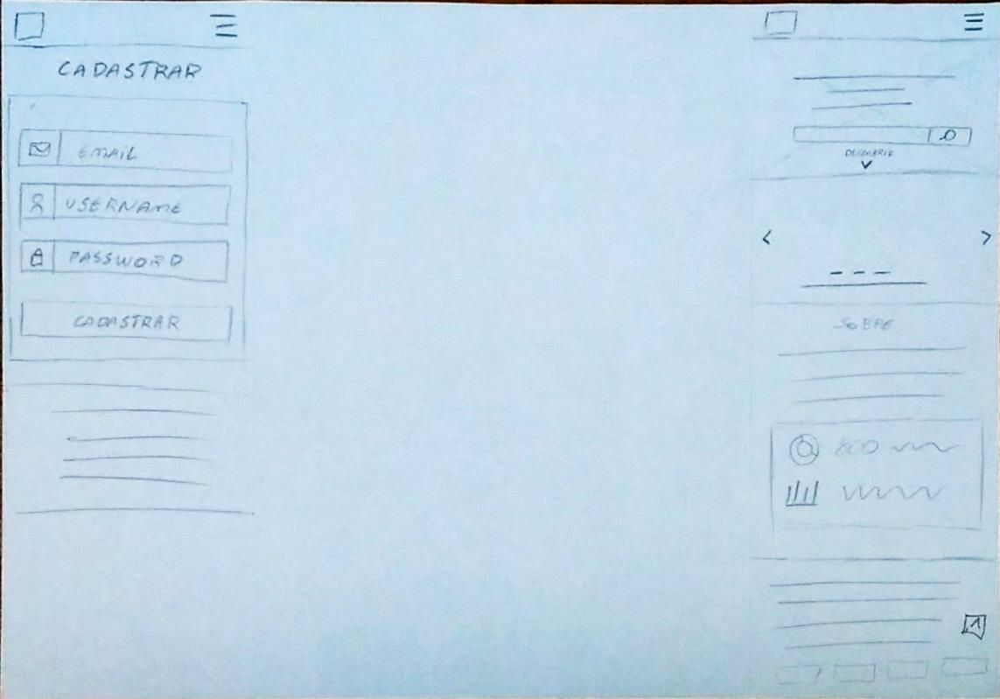
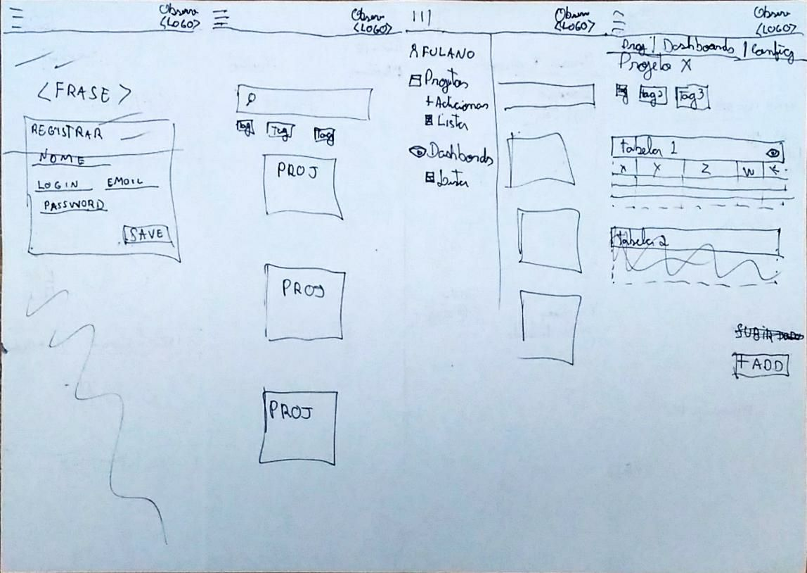
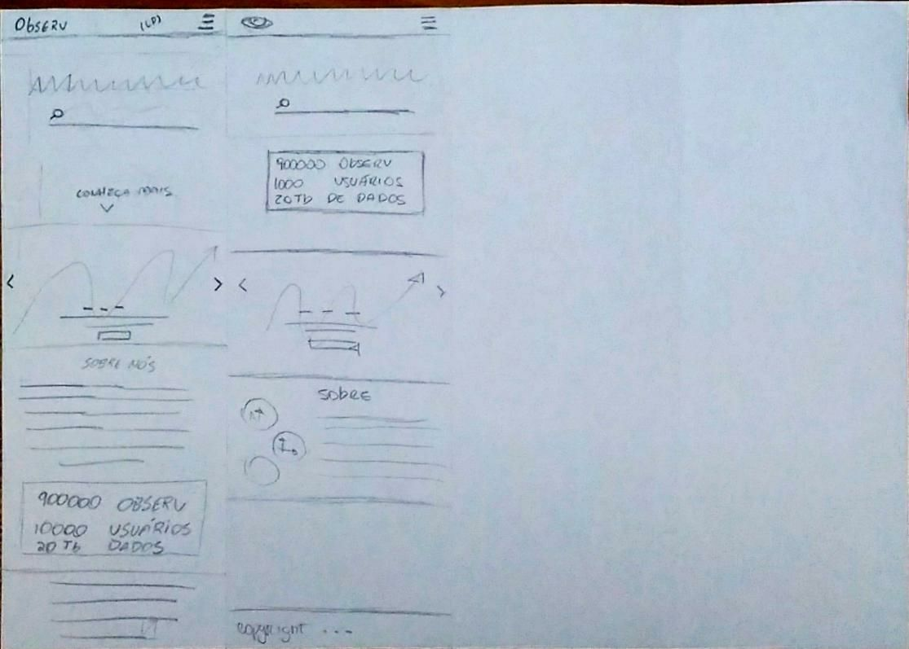
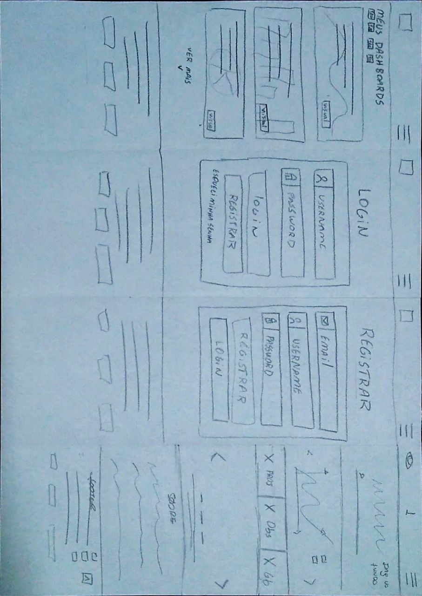
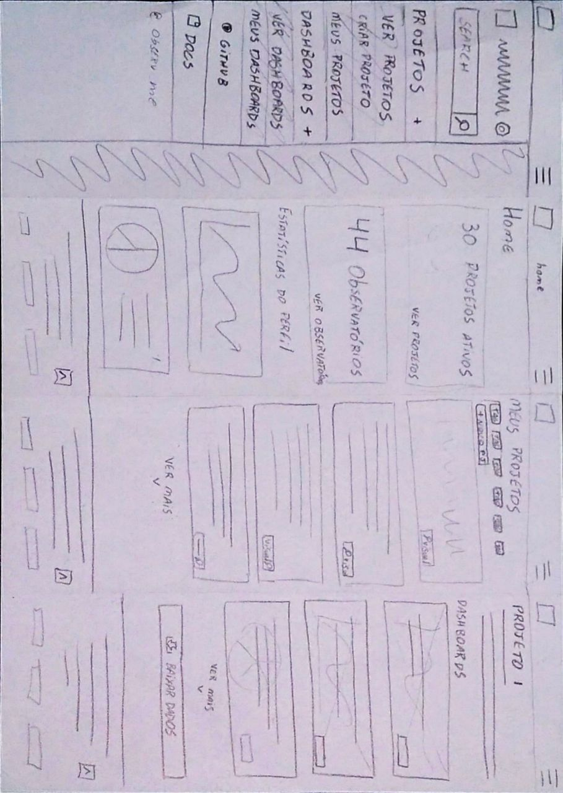

# Protótipos
Após constatada as condições ruins de usabilidade do nosso front-end, a equipe
decidiu refatorar a interface, com a finalidade de tornar a utilização
da nossa aplicação mais agradável para o usuário.

Foi realizada uma sessão de **Crazy 8's** com alguns membros da equipe, a fim
de coletar e trabalhar idéias para a interface. Os tópicos a seguir representam
os novos protótipos levantados após as revisões.

## Alta Fidelidade
  O protótipo de alta fidelidade pode ser encontrado em um repositório à parte e
pode ser acessado no seguinte link: [Protótipos-Observ](https://github.com/IagoCarvalho/Prototipos-Observ)

## Baixa fidelidade

  Versões iniciais resultantes do Crazy 8's

  
Versões Finais:

